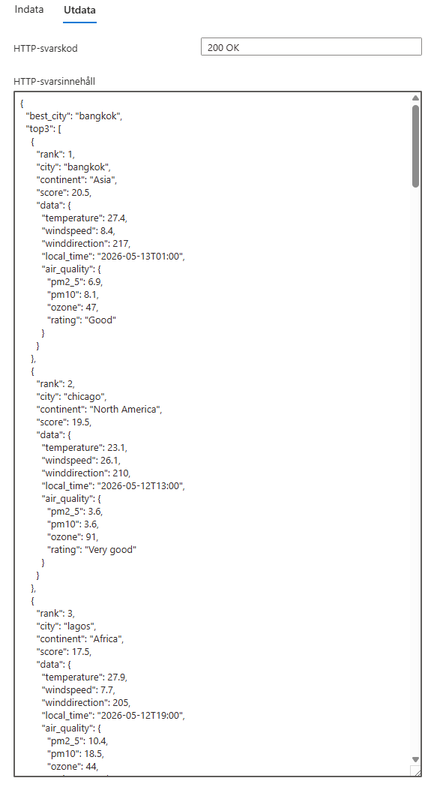
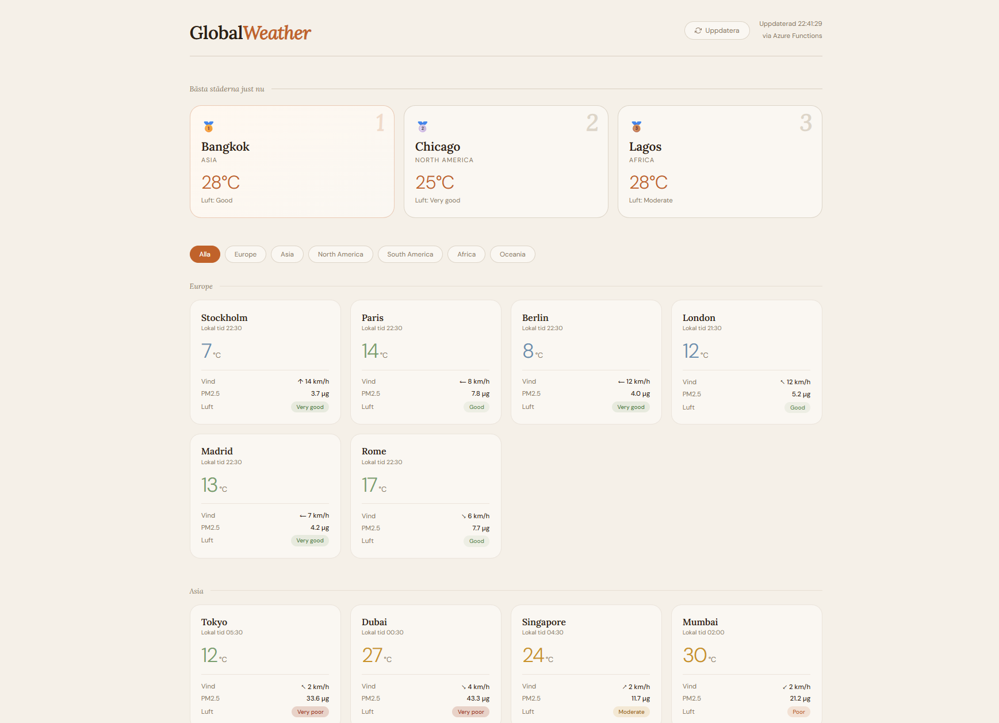

# 🌍 Global Weather API

## A cloud-based web service built in Microsoft Azure that fetches real-time weather and air quality data for 29 major cities across 6 continents.

## Features

- Real-time temperature, wind speed and wind direction
- Air quality data including PM2.5, PM10 and ozone levels
- Automatic ranking of the top 3 cities with the best conditions
- Data organized by continent and city
- Built with Azure Functions (Serverless)

## Technologies

- Microsoft Azure Functions (Node.js)
- Open-Meteo Weather API
- Open-Meteo Air Quality API
- HTML / CSS / JavaScript

## How it works

A client sends an HTTP request to the Azure Function. The function fetches data from two external APIs for each city, processes and structures the data by continent, calculates which city has the best conditions, and returns everything as a JSON response — which is then displayed on the website as a dashboard.

## Cities covered

**Europe** — Stockholm, Paris, Berlin, London, Madrid, Rome

**Asia** — Tokyo, Dubai, Singapore, Mumbai, Shanghai, Seoul, Bangkok

**North America** — New York, Los Angeles, Toronto, Chicago, Mexico City

**South America** — São Paulo, Buenos Aires, Bogotá

**Africa** — Cairo, Nairobi, Cape Town, Lagos, Casablanca

**Oceania** — Sydney, Auckland, Melbourne
